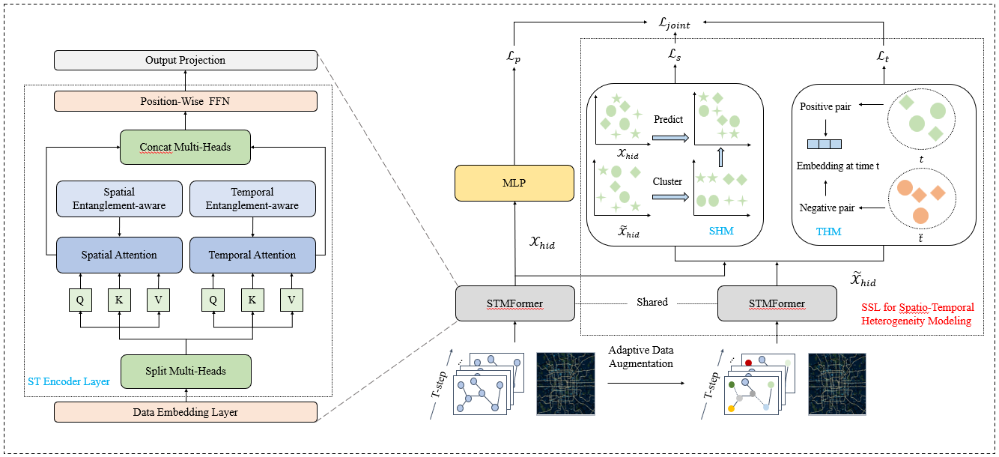

# SSL-STMFormer Self-Supervised Learning Spatio-Temporal Entanglement Transformer for Traffic Flow Prediction

This is a PyTorch implementation of Self-Supervised Learning Spatio-Temporal Entanglement Transformer for Traffic Flow Prediction (**SSL-STMFormer**) for traffic flow prediction, as described in our paper: Zetao Li, Zheng Hu, Peng Han, Yu Gu, Shimin Cai.  



## Requirements

Our code is based on Python version 3.7.16 and PyTorch version 1.13.1. Please make sure you have installed Python and PyTorch correctly. Then you can install all the dependencies with the following command by pip:

```shell
pip install -r requirements.txt
```

## Data

The dataset link is [Google Drive](https://drive.google.com/drive/folders/176Uogr_kty02NQcM9gB2ZT_ngulEhb0H?usp=share_link). You can download the datasets and place them in the `raw_data` directory.

All 6 datasets come from the [LibCity](https://github.com/LibCity/Bigscity-LibCity) repository, which are processed into the [atomic files](https://bigscity-libcity-docs.readthedocs.io/en/latest/user_guide/data/atomic_files.html) format. The only difference with the datasets provided by origin LibCity repository [here](https://drive.google.com/drive/folders/1g5v2Gq1tkOq8XO0HDCZ9nOTtRpB6-gPe?usp=sharing) is that the filename of the datasets are differently.

## Train & Test

You can train and test **SSL-STMFormer** through the following commands for 6 datasets. Parameter configuration (**--config_file**) reads the JSON file in the root directory. If you need to modify the parameter configuration of the model, please modify the corresponding **JSON** file.

```shell
python run_model.py --task traffic_state_pred --model SSL-STMFormer --dataset PeMS04 --config_file PeMS04
python run_model.py --task traffic_state_pred --model SSL-STMFormer --dataset PeMS08 --config_file PeMS08
python run_model.py --task traffic_state_pred --model SSL-STMFormer --dataset PeMS07 --config_file PeMS07
python run_model.py --task traffic_state_pred --model SSL-STMFormer --dataset NYCTaxi --config_file NYCTaxi --evaluator TrafficStateGridEvaluator
python run_model.py --task traffic_state_pred --model SSL-STMFormer --dataset CHIBike --config_file CHIBike --evaluator TrafficStateGridEvaluator
python run_model.py --task traffic_state_pred --model SSL-STMFormer --dataset T-Drive --config_file T-Drive --evaluator TrafficStateGridEvaluator
```

## Reference Code

Code based on [LibCity](https://github.com/LibCity/Bigscity-LibCity)  and [PDFormer](https://github.com/BUAABIGSCity/PDFormer?tab=readme-ov-file) framework development, an open source library for traffic prediction.

## Cite

If you find the paper useful, please cite as following:

```
@inproceedings{sslstmformer,
  title={SSL-STMFormer: Self-Supervised Learning Spatio-Temporal Entanglement Transformer for Traffic Flow Prediction},
  author={Zetao Li and
  		  Zheng Hu and
  		  Peng Han and 
  		  Yu Gu and 
  		  Shimin Cai},
  booktitle = {{AAAI}},
  year      = {2025}
}
```

If you find [LibCity](https://github.com/LibCity/Bigscity-LibCity) and [PDFormer](https://github.com/BUAABIGSCity/PDFormer?tab=readme-ov-file) useful, please cite as following:

```
@inproceedings{libcity,
  author    = {Jingyuan Wang and
               Jiawei Jiang and
               Wenjun Jiang and
               Chao Li and
               Wayne Xin Zhao},
  title     = {LibCity: An Open Library for Traffic Prediction},
  booktitle = {{SIGSPATIAL/GIS}},
  pages     = {145--148},
  publisher = {{ACM}},
  year      = {2021}
}
@inproceedings{pdformer,
  title={PDFormer: Propagation Delay-aware Dynamic Long-range Transformer for Traffic Flow Prediction},
  author={Jiawei Jiang and 
  		  Chengkai Han and 
  		  Wayne Xin Zhao and 
  		  Jingyuan Wang},
  booktitle = {{AAAI}},
  publisher = {{AAAI} Press},
  year      = {2023}
}
```

